# Bases de Datos II
# Tarea Corta 2  
#### Equipo de trabajo:
Granados Retana, Diego - 2022158363
Granados Retana, Daniel - 2022104692
Mora Montes, Diego - 2022104866
Gutierrez Conejo, Eduardo - 2019073558
Cardona Quesada, Jose Ricardo - 2021022613

---
## Manual de instalación

A continuacion se presenta un manual de instalacion para distintos motores de bases de datos junto con respectivos codigos para implementar backups y restaurar datos a través de una cuenta AWS.

#### Paso 1. Selección del Motor de Bases de datos a probar

Dentro de la carpeta para la TC2 se incluyen varios motores de bases de datos, la lista de todos estos es:

• MariaDB
• PostgreSQL
• Elasticsearch
• MongoDB
• Neo4J
• CouchDB

Una vez se haya seleccionado la base de datos para la que se desea probar backups y restauración se hace lo siguiente:

Se ingresa al path `TC2\helm\databases\values.yaml` donde se va a cambiar ciertos parámetros para hacer backups solo en la base deseada e iniciar solo la base deseada. Por cada base de datos saldrá el siguiente parámetro:

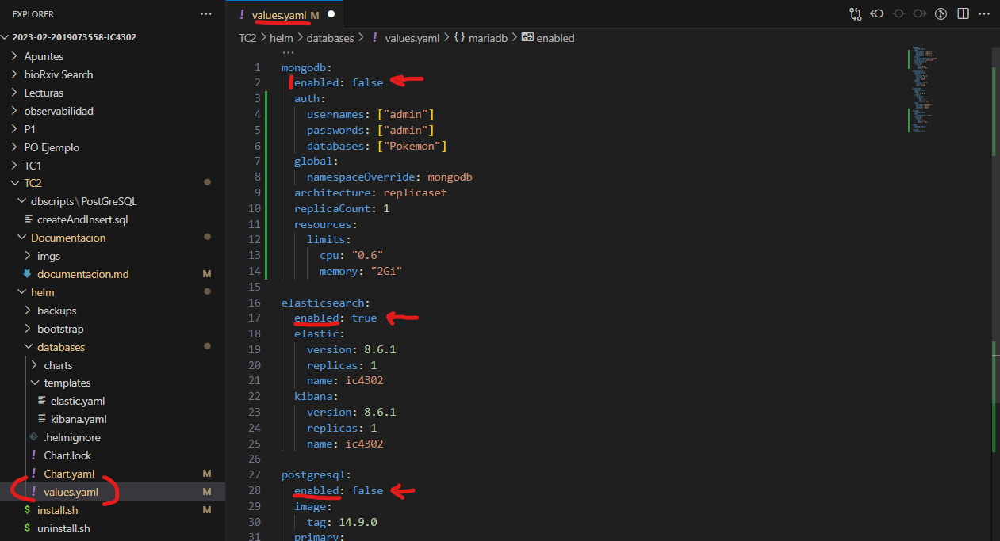

Enabled hace referencia a si se quiere inicializar o no ese motor de base de datos, la recomendación es no correr más de uno al mismo tiempo.

En caso de querer correr ese motor cambiar `Enabled: True` por la versión actual, y al resto de motores ingresar `Enabled: False` para apagarlos

Una vez hecho esto se debe ingresar a  `TC2\helm\backups\values.yaml`, y hacer lo mismo con las bases de datos que aparecen. 

IMPORTANTE: En caso de querer ejecutar backups a través de elastic **NO es necesario** ingresar a `TC2\helm\backups\values.yaml` a habilitar la base también

# Aqui nose si falta algo para habilitar si se quieren backups o restores.

Finalmente, antes de ejecutar el código 

#### Paso 2. Ejecución del Código

Una vez se haya escogido la base, el siguiente paso es ejecutar los comandos para levantarla con sus respectivos parámetros, para esto ingresamos a cualquier terminal desde la cuál se puedan ejecutar comandos Linux. Una vez aqui abriremos la carpeta desde la terminal:

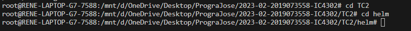

Una vez en la carpeta donde hayamos descargado el proyecto se insertarán los siguientes comandos:

`cd TC2`
`cd helm`

Una vez aqui la terminal se encuentra en la carpeta donde se pueden ejecutar los archivos para la instalacion y desinstalación de las bases de datos.

##### Para Instalar la base deseada con los parámetros específicados

En la terminal primero se recomienda ejecutar:

`dos2unix install.sh`

Seguido de esto ejecutamos el comando: `./install.sh`

Una vez hecho esto la terminal comenzará a instalar todos los deployments necesarios para la ejecucuón correcta del programa:

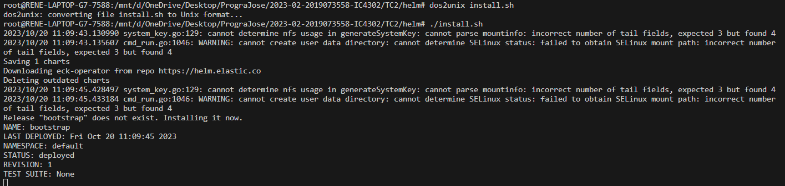

Una vez este código se verá lo siguiente:
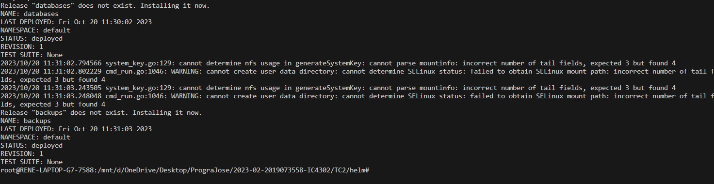

Este código habilita la base deseada para las pruebas que se quieran ejecutar con ella. Cada una de las bases es distinta.

### Ejecución de Bases y pruebas

#### IMPORTANTE

Para poder verificar si los archivos correspondientes a una de las bases se encuentran en el bucket, se puede hacer lo siguiente:

En la terminal, con el proyecto abierto, nos aseguramos de volver a la carpeta TC2 y en caso de estar adentro de Helm, hay que regresar. Para esto, se ejecuta el comando `cd ..` hasta regresar a la dirección del TC2.

Una vez en esta dirección,se ejecutan los comandos:

`cd utils`

`dos2unix install.sh`

`./install.sh`

Este código va a instalar un pod en la red de kubernetes donde se pueden ejecutar comandos para verificar si el bucket tiene archivos en la dirección que se quiere revisar. Al finalizar se podrá ver lo siguiente:

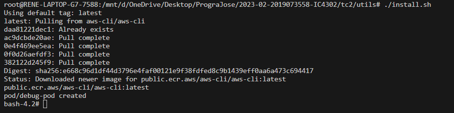

Aqui se pueden ingresar comandos para ver las distintas direcciones donde estan almacenados los backups, normalmente estas direcciones siguen el patrón:

2019073558 / [nombre base]

EJ:

2019073558/elastic

2019073558/postgresql

El comando para ver los archivos en esa dirección es:

aws s3 ls s3://tec-ic4302-02-2023/2019073558/[nombre Base]/

EJ:

aws s3 ls s3://tec-ic4302-02-2023/2019073558/postgresql/

aws s3 ls s3://tec-ic4302-02-2023/2019073558/elastic/

Al ejecutar estos comandos se puede ver lo siguiente:

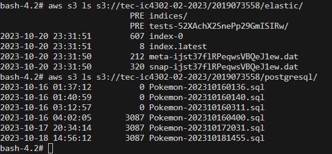

Claramente se despliegan los distintos backups que han sido creados hasta el momento para las respectivas bases.

#### Elastic Search con Kibana

A continuación se muestra una guía para hacer backups y restores en la base elasticsearch a través de su interfaz kibana. Para este paso se asume que ya se habilito la base y se ejecuto el script de instalación desde la terminal.

Lo primero que se debe hacer es tener instalada una aplicación para poder visualizar el kubernetes deployment y fácilmente obtener la informaión importante de los pods.

Para esta funcionalidad se recomienda hacer uso de **LENS**, el resto de esta guía se basará en el uso de esta aplicación para conectar los pods.

Desde Lens lo primero que haremos será entrar el deploymen de docker desktop y nos iremos a la sección de **`PODS`**, una vez aqui entraremos al siguiente pod:

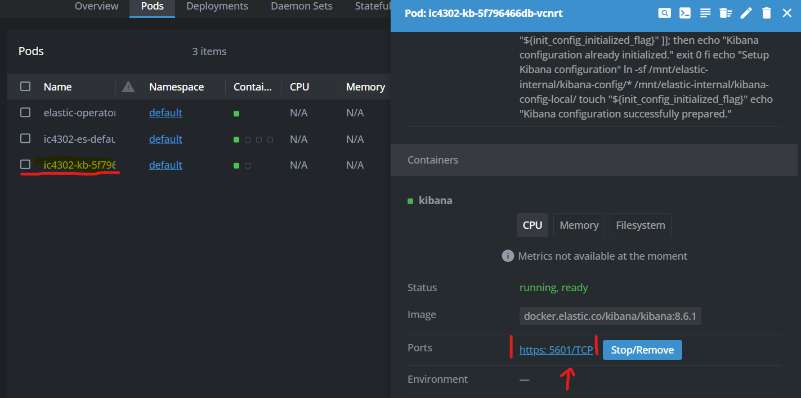

Al abrir el pod se debe buscar la sección señalada a la derecha, esta contiene un link que nos permitirá acceder de forma local a la interfaz Kibana para interactuar con la base de datos elasticsearch.

Una vez se haya hecho forward del port y se haya ingresado al sitio aparecerá lo siguiente:

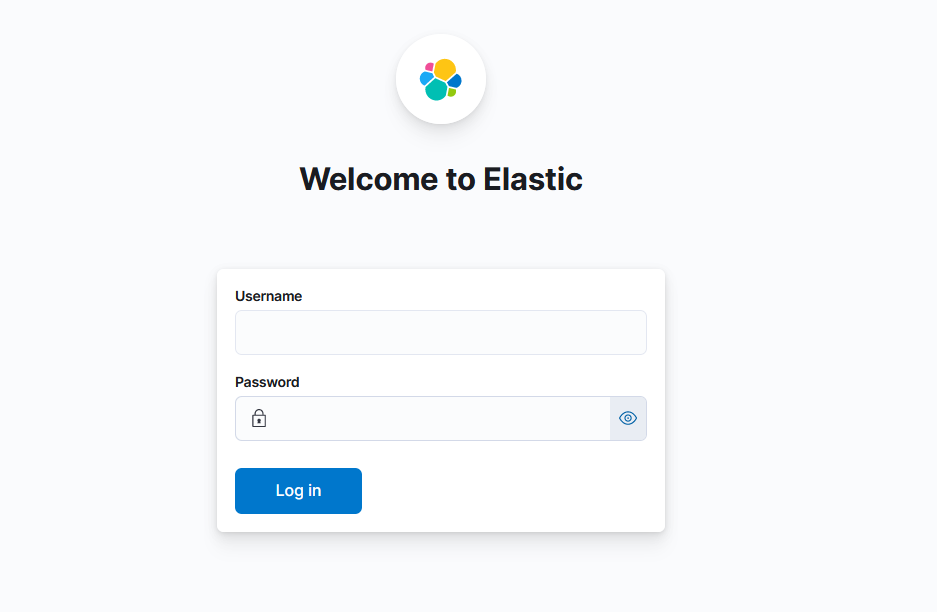

Se solicita un usuario y una contraseña para poder ingresar al servicio Kibana, para obtener estos datos volvemos a **LENS** y buscamos la sección:

`Config/Secrets`, una vez aqui abrimos el siguiente secret:

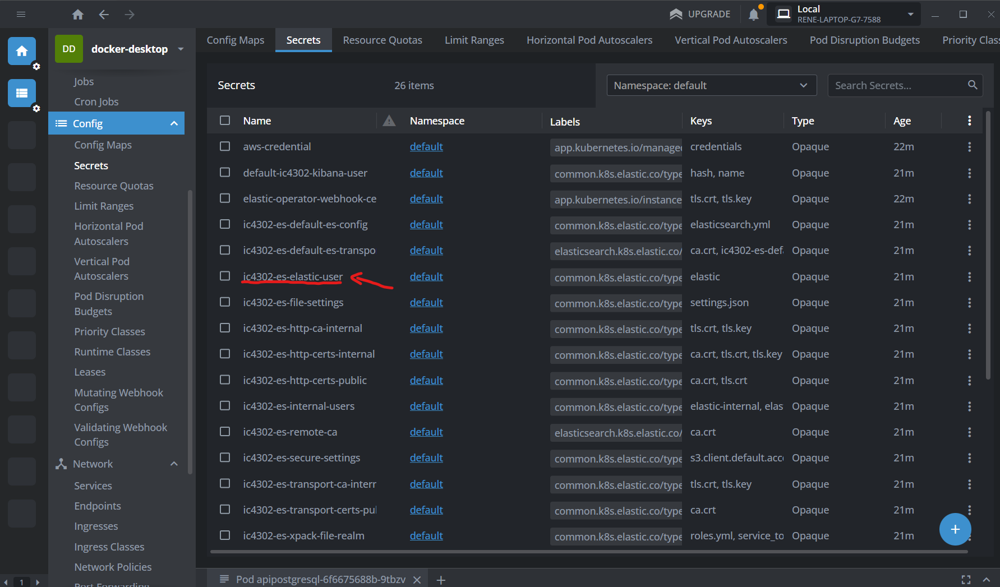

Una vez aqui buscamos los siguientes datos:

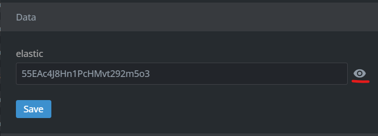

Estos corresponden a mi usuario y contraseña de elastic search. Por lo tanto copio estas credenciales y las pongo en la interfaz. El usuario será elastic y la contraseña el otro valor.

Despúes de ingresar las credenciales correctamente saldra una imagen similar a esta:

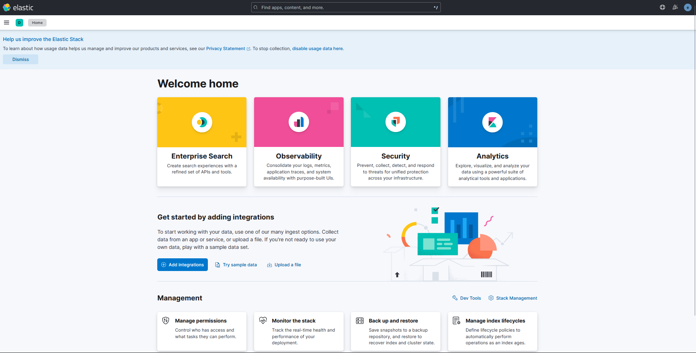

En esta pantalla buscaremos la opcion stack management e ingresaremos
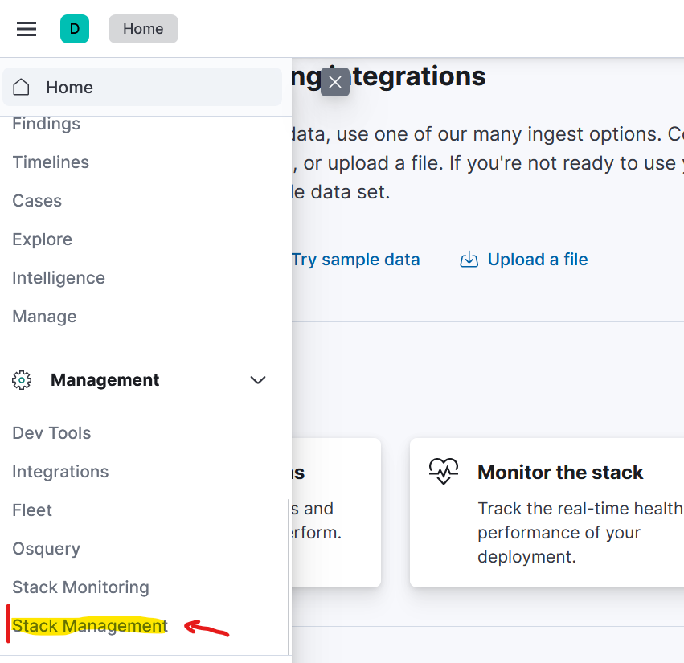

Una vez en esta interfaz, se busca la sección con el nombre **Snapshot and Restore**, en elastic los backups son llamados de esta forma.

Para restaurar o guardar backups lo primero es definir la dirección donde se van a guardar/obtener. Para esto se va a agregar el repositorio donde vamos a manejar nuestros backups de elastic, este hace referencia a la dirección del bucket de AWS y el cliente que vamos a usar para guardar los datos correspondientes a los snapshots. 

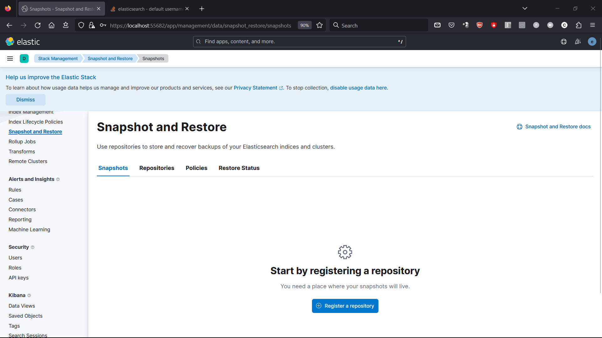

Una vez aqui se selecciona `Register a repository`  para crearlo. Una vez adentro:

Seleccionamos el tipo de repositorio, en este caso debe de ser AWS S3 y se le pone el nombre que quiera al repositorio.

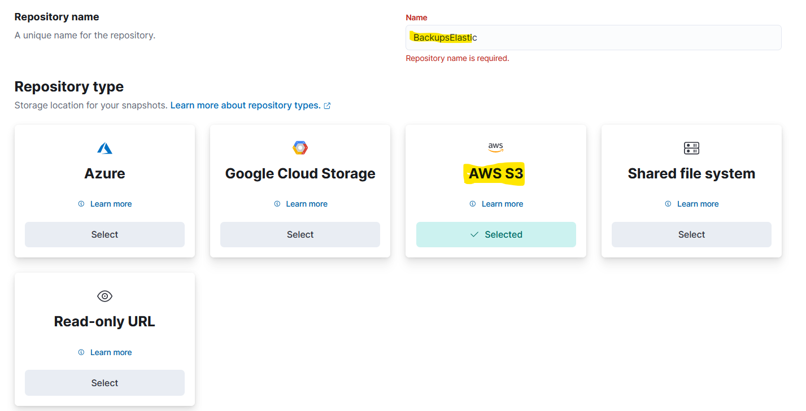

En la siguiente pantalla se solicitan los datos que le queremos poner al repositorio. En esta sección los únicos campos relevantes son:

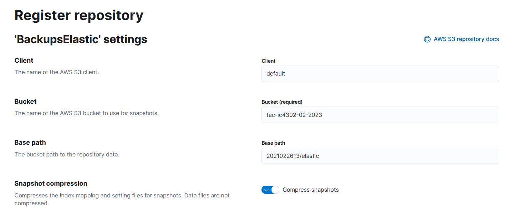

En el campo Client ingresamos: `default`

En el campo bucket ingresamos: `tec-ic4302-02-2023`

En el campo Base path se debe ingresar: `2019073558/elastic` 

Es importante anotar este base path para posteriormente usarlo al definir la política para los backups.

El resto de campos para el repositorio se dejan por default y se finaliza la creación de este. El resultado de este proceso se verá similar a esto:

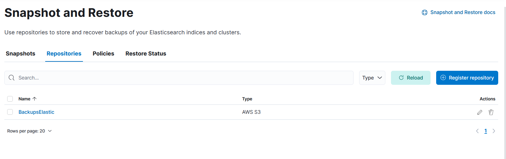

---

#### Para hacer pruebas

Cabe aclarar que el repo será adonde guardemos los backups, pero aún no se ha creado ninguna política para crear backups o se han creado indices para los cuáles probar esto. Por lo tanto antes de seguir con el proceso de backups se van a insertar indices en la base elasticsearch manualmente, posteriormente se mostrará como hacer un backup con esta. Finalmente se borrarán los datos y se tratará de restauralos usando el snapshot.

Primero, para ingresar los datos a la base es necesario volver al menú principal de la interfaz de Kibana, una vez aqui buscamos la siguiente sección:

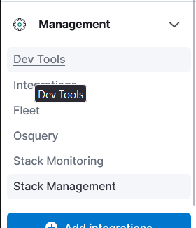

Ingresamos a Dev Tools, y se presentará la siguiente interfaz:
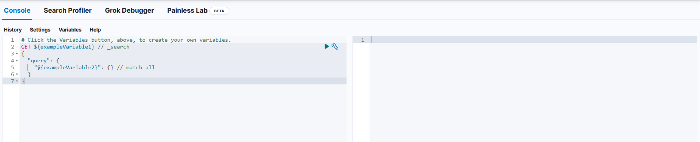

Aqui escribimos los siguientes comandos:

---
**PUT /indice-backup**

---
**POST /indice-backup/_doc
{
  "titulo": "Prueba Backups",
  "contenido": "Este documento es una prueba de backups",
  "integrantes": ["Granados Retana Diego", "Granados Retana Daniel","Mora Montes Diego","Gutierrez Conejo Eduardo","Cardona Quesada Jose Ricardo"]
}**

---
**GET /indice-backup/_search 
{
  "query": {
    "match": {
      "titulo": "Prueba Backups" 
    }
  }
}**

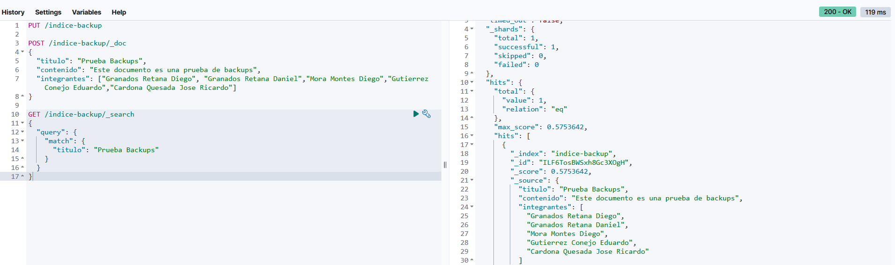

Una vez hecho esto se insertaron datos y un índice para el cuál podemos hacer backups

---

#### Snapshots

Para guardar snapshots de nuestra base completa o un índice en ella hay dos maneras, se puede hacer manualmente a través de comandos o automáticamente definiendo una política de guardado.

##### Método Manual
Para hacer un backup manualmente, desde la misma interfaz de Dev Tools se puede ingresar un comando como este:

**PUT /_snapshot/ [NOMBRE_REPOSITORIO] / [NOMBRE_SNAPSHOT]
{
  "indices": "[NOMBRE INDICE]",
  "ignore_unavailable": true,
  "include_global_state": false 
}**

Donde se reemplaza la dirección con el nombre del indice al que queremos tomar un snapshot. En este caso para el ejemplo se usara el siguiente:

**PUT /_snapshot/BackupsElastic/indice-backup_20231020
{
  "indices": "indice-backup",  
  "ignore_unavailable": true,
  "include_global_state": false 
}**

Para revisar que este snapshot se encuentra disponible en el repositorio y en AWS se puede revisar de dos maneras:

La primera opción es ingresar a la sección de Stack Management y Snapshot-Restore dentro de la interfaz de Kibana. Una vez aqui se verá lo siguiente:

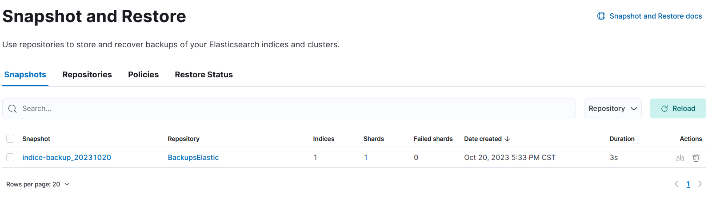

Si se logro crear correctamente el snapshot, va a aparecer en esta sección. La segunda opción es a través de el debug-pod, como se menciona en la sección IMPORTANTE, previo a esta. Al utilizar el debug pod se puede observar el índice recién almacenado

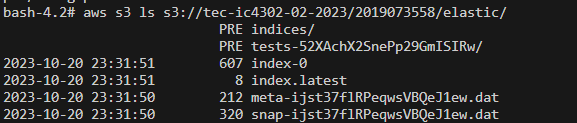

#### Automático
El segundo método para hacer backups, es estableciendolos automáticamente a través de un policy, usando uno de estos, se pueden establecer la creación de backups cada cierto tiempo automáticamente, junto con un tiempo para el cúal cuando se pase sean eliminados automáticamente también.

Para esto en la misma sección de Snapshots and Restore dentro de la Interfaz de Kibana se accede a la sección de Snapshot and Restore y una vez ahi se entra a Policies/Create a Policy:

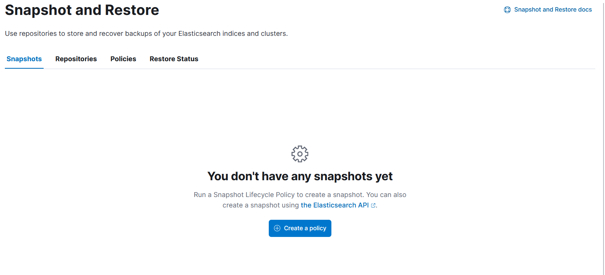

Si se ingresa a esta Interfaz se le presenta al usuario con lo siguiente:

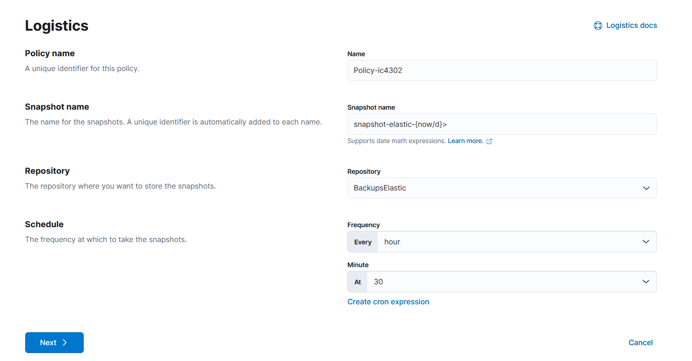

Aqui se solicitan los siguientes datos del usuario:

* **Policy Name:** Aqui se le pone un nombre a la política, este valor es a gusto del usuario
* **Snapshot Name:** En esta sección se le debe de poner un nombre a los snapshots que se van a almacenar, la plataforma automáticamente les agrega un identificador único al final
* **Repository:** Aqui se debe poner el nombre del repositorio previamente creado, si no se ingresa un repositorio válido no se creará la política
* **Schedule:** En esta parte se debe definir cada cuanto tiempo se quieren hacer backups de la plataforma, se puede definir si se quiere cada ciertas horas, dias, mes, etc.

Una vez se han ingresado los datos, se pasa a la siguiente página:

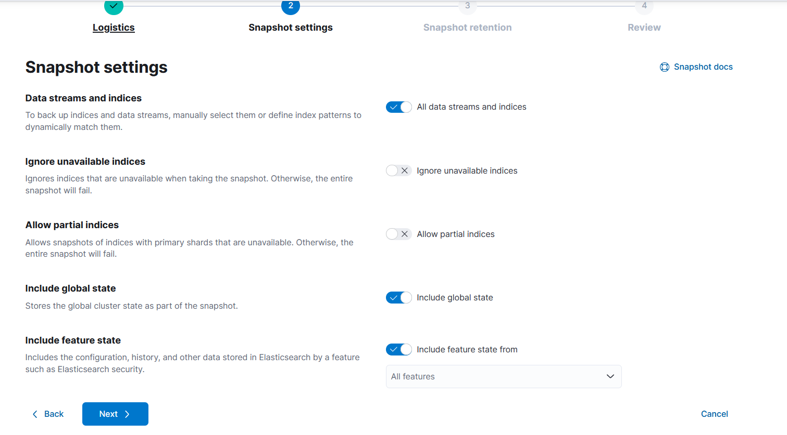

En esta sección no es necesario cambiar nada, es cuestión de dejarlo con sus configuraciones por default, esto va a guardar todos los indices de la base automáticamente, sin embargo, si se quiere guardar solo un índice

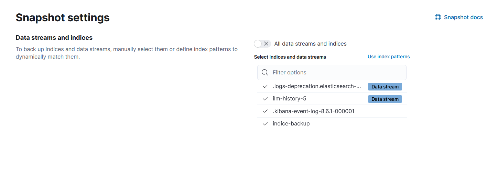

Se puede apagar esta configuración, aqui se pueden seleccionar los indices que si se quieran guardar, si tienen un check a la izquierda van a ser parte del snapshot, sino no se incluyen.

Se pasa a la siguiente página:

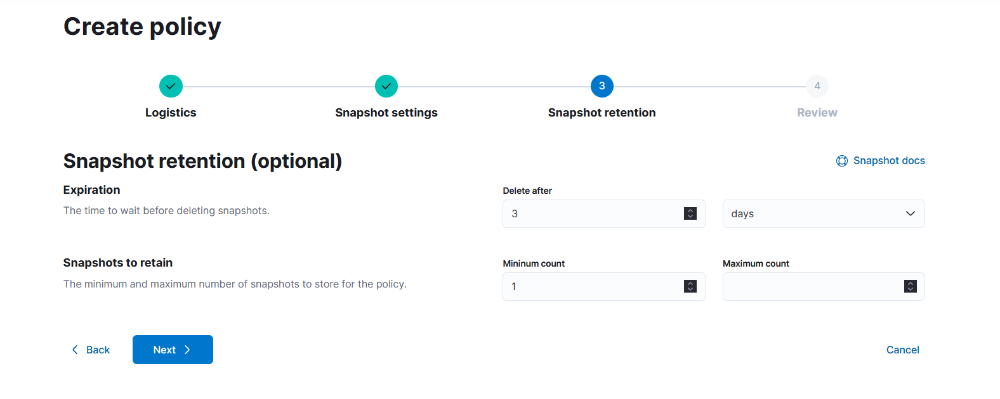

Esta es la sección final para crear un policy, aquí se puede definir **Si se quieren borrar los backups después de cierto tiempo, y si se quieren definir un mínimo a mantener**. A través de esta sección se puede configurar los puntos extra de la tarea, indicando la cantidad de días tras los que se quiere borrar los backups.

Finalmente, le damos next y se va a crear el policy en esta sección:

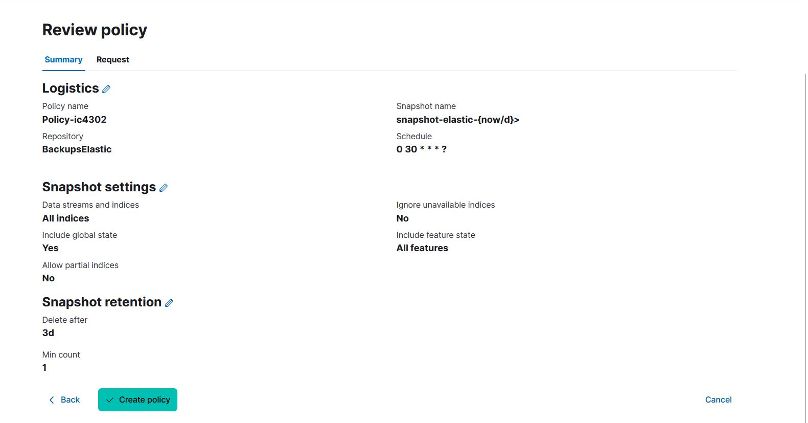

Confirmamos que los datos están correctos y se le da crear,como resultado, si se hizo bien debe de aparecer lo siguiente:

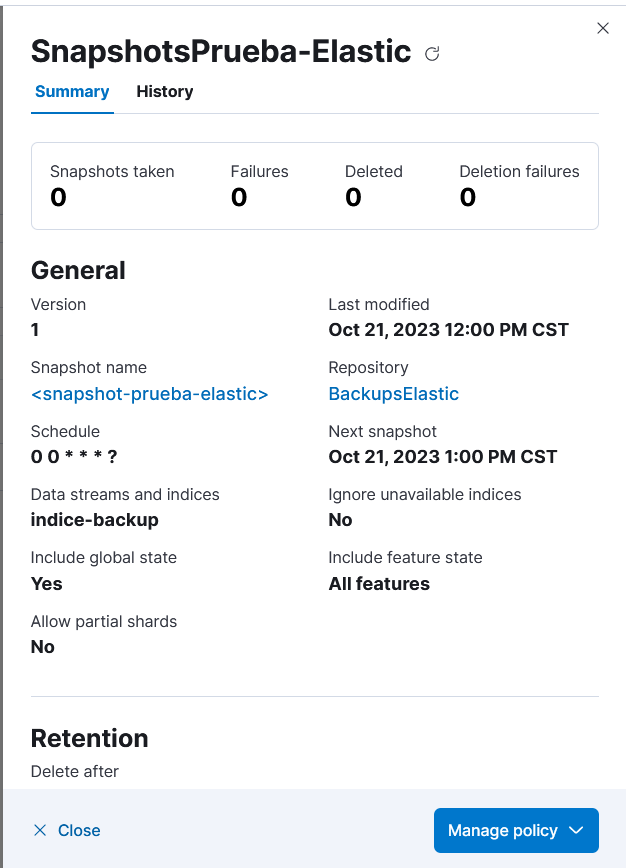

En este ejemplo solo se esta haciendo backup del index llamado: `indice-backup`

Despues de crear el policy y repositorio se van a crear backups automáticamente cada cierto tiempo dependiendo de lo definido al crear el policy.

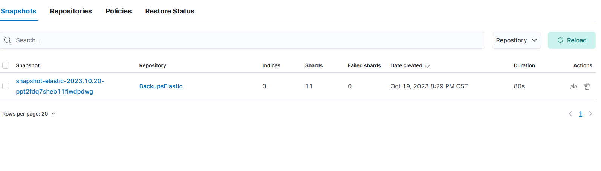

Verificar si se subieron al AWS Bucket los backups
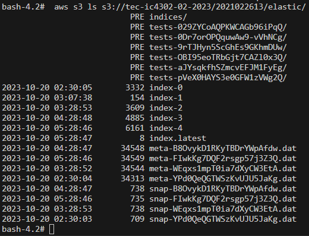

#### Restore

Para probar la restauración de datos usando Kibana, se deben haber hecho los pasos anteriores y al menos se debe tener:

* Un indice con datos
* Un Snapshot del Indice

Una vez se tienen esto, la forma más sencilla de probar es desde la sección DEV TOOLS de la interfaz de kibana, borrar el indice y tratar de restaurar sus datos usando el snapshot.

Si hacemos un GET del indice queda claro que si existe y sus datos son los siguientes:

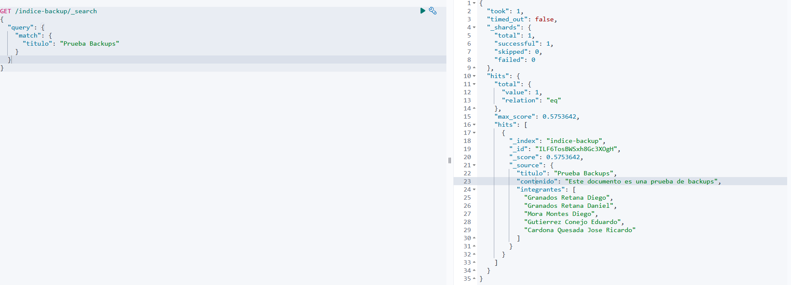

Ahora se procede a verificar que si existe un snapshot con ese index:

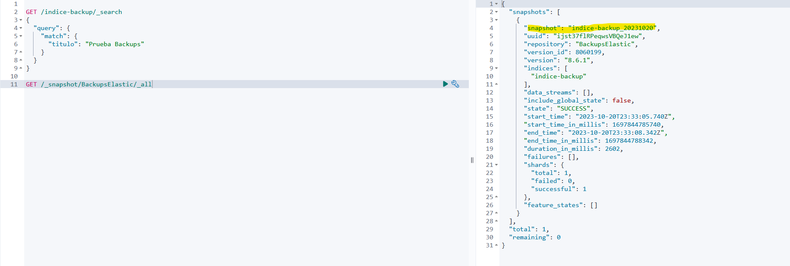

Para esto se uso el comando: **`GET /_snapshot/BackupsElastic/_all`**

Una vez verificados ambos, se va a borrar el índice de la base de datos elasticSearch:
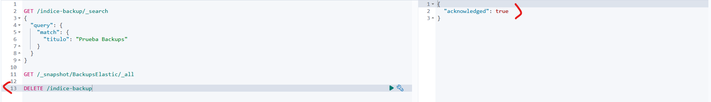

Se utiliza el comando: **`DELETE /indice-backup`**

Revisando si todavía existen los datos usando GET, se obtiene:

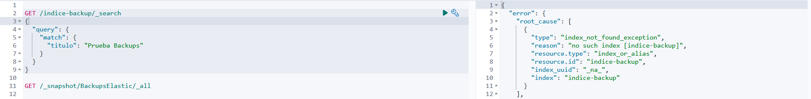

##### Restauración

Una vez eliminado, hay dos maneras de restaurar el índice dentro de Kibana:

###### Comandos
La primera opción para restaurar el índice o la base es utilizando comandos y el nombre del snapshot que se quiere restaurar, el comando sería similar a esto:

**POST /_snapshot/[Nombre Repo]/[Nombre Snapshot]/_restore
{
  "indices": "[Indice a restaurar]",
  "include_global_state": false
}**

En el caso de nuestro ejemplo se ejecuta el siguiente comando:

**POST /_snapshot/BackupsElastic/indice-backup_20231020/_restore
{
  "indices": "indice-backup",
  "include_global_state": false
}**

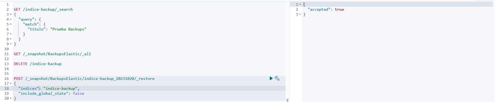

Ahora si probamos el GET, deberían de volver a aparecer los datos del Index:

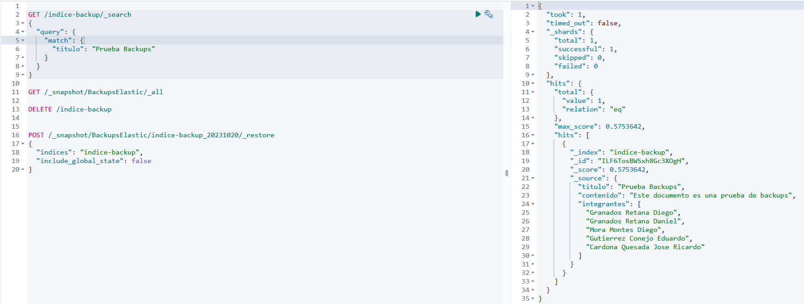

###### Usando Interfaz Snapshot and Restore

La segunda opción para restaurar un índice eliminado es a través de la Sección Snapshot and Restore dentro de la Interfaz de Kibana en la sección de Stack Management. Una vez aqui buscamos lo siguiente:

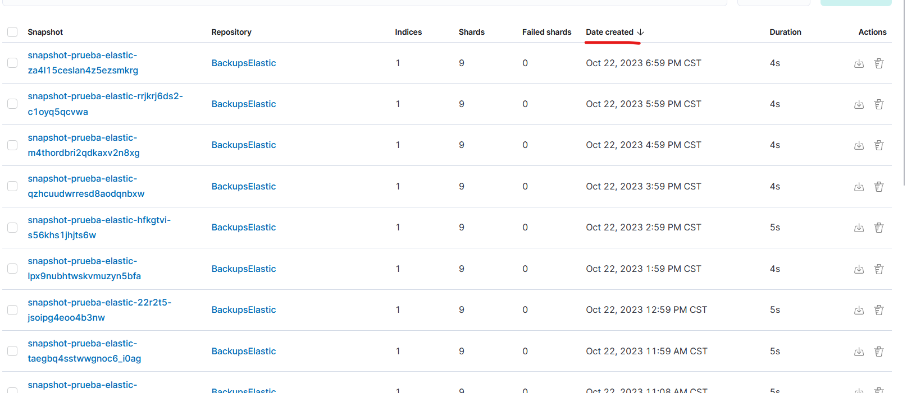

Aqui aparecerán todos los snapshots creados, ya sea que se crearon manualmente con comandos o a través de una política. Estos se encuentran en orden descendente del creado más reciente al más antiguo. Se recomienda usar snapshots más nuevos para regresar a un estado más reciente de la base de datos en caso de un fallo.

Se selecciona el snapshot que se quiera restaurar y se clickea para ver detalles de este. Una vez abierto podremos ver la opción de restaurar:

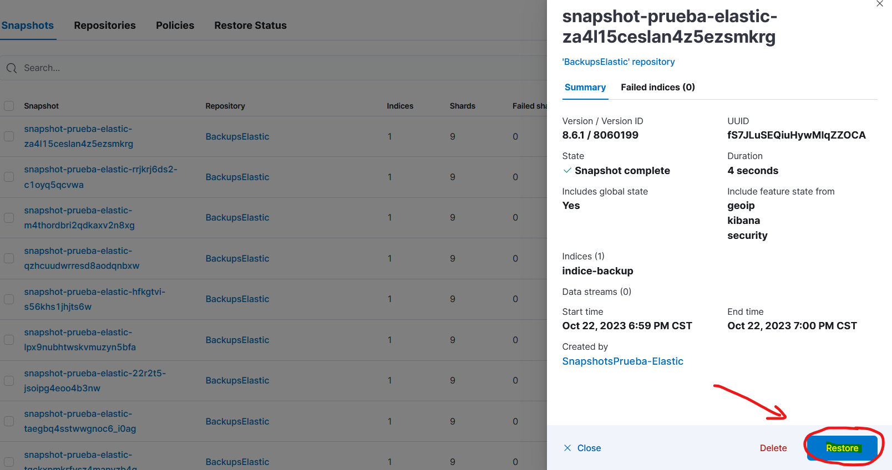

Si seleccionamos esta opcíon se desplegará un menú interactivo de restauración donde se pueden seleccionar los indices del snapshot que se quieren restaurar, si se quieren mantener los mismos nombres para los indices o cambiarlos, etc. A continuación se presenta este menú:

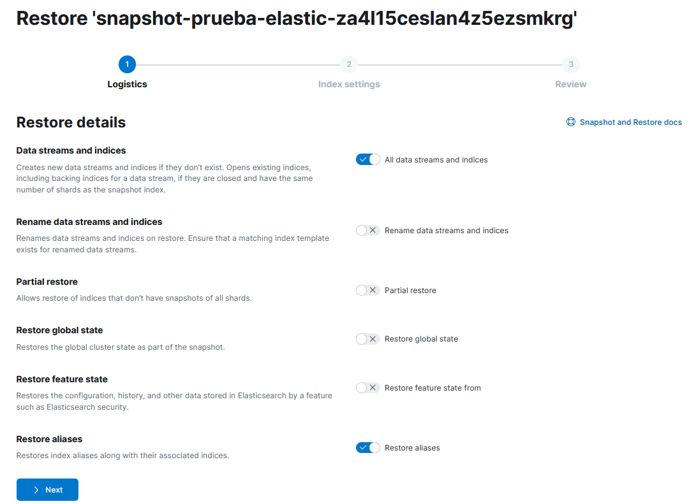

### Conclusiones y Recomendaciones

#### Conclusiones

* El uso de almacenamiento en la nube con AWS S3 facilita la escalabilidad y accesibilidad de los backups, pero requiere tomar en cuenta consideraciones adicionales de seguridad a la hora de hacer el código y mantener su versionamiento. 

* Si bien Elasticsearch requiere una configuración inicial más elaborada y el proceso para habilitar snapshots es más manual, una vez que se tienen los componentes configurados adecuadamente, la automatización de snapshots y restores resulta bastante sencilla y más fácil de entender desde una perspectiva de usuario 

#### Recomendaciones

* Para implementar los backups desarrollados en este proyecto en un escenario real, se podrían implementar junto con herramientas de monitoreo como Prometheus y Grafana. Contar con dashboards personalizados en Grafana facilitaría identificar tendencias, bottlenecks y problemas en los procesos de backup. 

* Para establecer backups en Elasticsearch, se recomienda hacer uso de la interfaz interactiva de Kibana para crear políticas de snapshots. Esto en lugar de ejecutar comandos manuales sobre la base ElasticSearch para hacer cada backup de forma individual, ya que provee una experiencia más amigable e intuitiva para los usuarios. 

* En lugar de tener las credenciales de acceso a la nube y el bucket hardcoded en los scripts de backup, se recomienda almacenar estas credenciales como secrets de Kubernetes . De esta manera se centraliza la gestión de credenciales sensibles y se evita exponerlas en el código. 

* Es crítico que el repositorio de código donde se almacena la tarea de backup se mantenga privado y con acceso restringido. De esta manera se evita que personas no deseadas puedan ver el código fuente y obtener las credenciales que dan acceso a la cuenta de AWS u otra plataforma en la nube. 

* Para optimizar el uso de almacenamiento en AWS, se recomienda hacer uso de una política de retención de backups automatizada. En lugar de retener todos los backups por tiempo indefinido, usar una política conserve los backups más recientes y necesarios, y elimine versiones antiguas que ya no son relevantes. 

* Es crítico validar periódicamente que al implementar backups, estos sean funcionales y permitan restaurar los datos correctamente. Por eso, al implementar componentes de backups se recomienda realizar pruebas regulares de restore a partir de los mismos para confirmar su correcto funcionamiento y capacidad de recuperación de información. 

* En una tarea de este tipo, dividir el trabajo es importante, pero también es importante que cada persona del equipo entienda su tarea. Se recomienda mantener una buena comunicación durante el desarrollo del proyecto y nunca quedarse con dudas. 

* A la hora de probar los backups generados, se recomienda hacer uso de un pod de depuración como el incluido en la solución de esta tarea. Dicho pod proporciona una terminal con conectividad directa al bucket de almacenamiento en AWS. Esto permite validar de forma efectiva que los respaldos se estén ejecutando correctamente y subiendo a la nube según lo esperado. 