# BioRxiv Search documentación

## Descripcion

BioRxiv Search es un motor de búsqueda de artículos científicos de Covid19 utilizando la base de datos Elasticsearch y el repositorio de descripciones de artículos científicos BioRxiv.

## Diagramas

A continuación, se presenta el diagrama de flujo y el diagrama de Arquitectura de BioRxiv Search.

### Diagrama de Flujo

El siguiente diagrama describe el proceso realizado por el BioRxiv Search.

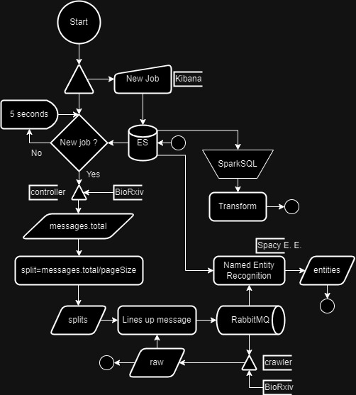

### Diagrama de Arquitectura

El siguiente diagrama muestra la implementación e interacción de los componentes del BioRxiv Search. Así como el flujo de datos dentro del sistema.

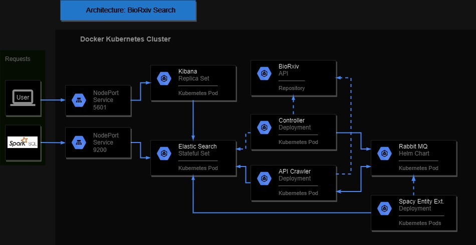  

### Diagrama de RabbitMQ

El siguiente diagrama muestra cómo están estructuradas las colas de RabbitMQ y la forma en que se comunican los componentes.  

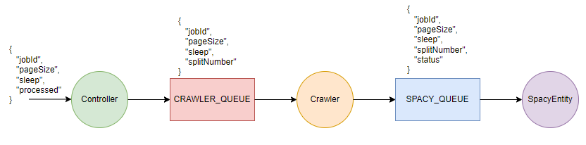
## Pre-instalación

Como pre-instalación del proyecto serán necesarias las siguientes aplicaciones:

- [Git](https://git-scm.com/downloads)
- [Python](https://www.python.org/downloads/)
- [Visual Studio Code](https://code.visualstudio.com/download)
- [Docker](https://www.docker.com/products/docker-desktop/)
- [Helm](https://helm.sh/docs/intro/install/)
- [Lens](https://k8slens.dev)
- [SparkSQL](https://archive.apache.org/dist/spark/spark-2.4.8/spark-2.4.8-bin-hadoop2.7.tgz)
- [Elastic Hadoop](https://artifacts.elastic.co/downloads/elasticsearch-hadoop/elasticsearch-hadoop-8.6.2.zip)

Extraer los elemenstos en un carpeta definida y copiar elasticsearch-hadoop-8.6.2.jar dentro de spark-2.4.8-bin-hadoop2.7/jars/ . Se debe verificar que el sistema este corriendo la version de JDK 1.8 ya que de otra forma no será posible correr el código de scala. Para verificar esto se pude correr el comando de:
`java -version` y verificar que la version de este sea la 1.8. De no ser la versión 1.8 se recomienda para evitar conflictos desinstalar java e instalar la versión necesaria para el proyecto.

[Kubernetes](https://docs.docker.com/desktop/kubernetes/) será implementado mediante la habilitación del cluster en la aplicación de Docker Desktop.

## Instalación
Para la instalación del cluster de Kubernetes es necesario ejecutar los siguientes comandos en el Git Bash: 

- `helm repo add elastic https://helm.elastic.com`
- `helm repo add bitnami https://charts.bitnami.com`
- `helm repo update`
- `cd bootstrap`
- `rm -rf Char.lock`
- `helm dependency build --skip-refresh`
- `cd ../stateful`
- `rm -rf Char.lock`
- `helm dependency build --skip-refresh`
- `cd ..`

Estas líneas de comando lo que realizan es importar los repositorios de Bitnami y Elasticsearch que son necesarios para la instalación de sus debidos componentes e instalar las dependencias de cada Helm chart. En seguida se continuará con la instalación de los componentes, empezando con el bootstrap, el cual instala el elastic operator:

- `helm upgrade --install bootstrap bootstrap`

Una vez se instala el bootstrap, se debe ejecutar el siguiente comando para instalar el stateful, el cual consiste en kibana, elasticsearch y rabbitMQ:
- `helm upgrade --install stateful stateful`

Una vez se finaliza de instalar el stateful (se puede verificar con `kubectl get pods` y verificando que todos los pods estén listos, o se puede verificar mediante la aplicación de Lens) se procede a instalar el stateless el cual corresponde al controller, API crawler y el Spacy.

- `helm upgrade --install stateless stateless`

Una vez finalizada la instalación se pueden realizar las pruebas de funcionamiento definidas en la sección de Ejecución y Pruebas Realizadas.  
Cuando ya es utilizó la aplicación y se desea desinstalarla, se debe realizar lo siguiente:  
1. Desinstalar todos los componentes:  
- `helm uninstall stateless stateful bootstrap`
2. Eliminar el Persistent Volume Claim de RabbitMQ:  
2.1 En Lens, vamos a _Storage_.  
2.2 Ingresamos a la sección de Persistent Volume Claim.  
2.3 Borramos el Persistent Volume Claim llamado _data-stateful-rabbitmq-0    
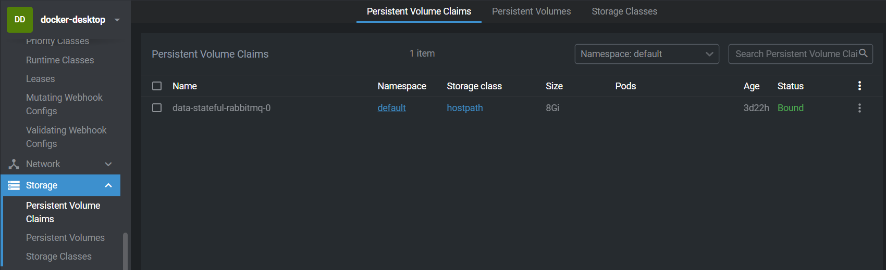

## Descripción de Componentes

### Elasticsearch
[Elasticsearch](https://www.elastic.co/elasticsearch/) es un motor de búsqueda y análisis de datos. Está diseñado para almacenar, indexar y buscar grandes volúmenes de datos en tiempo real. Utiliza una estructura basada en JSON. Esta es la base de datos principal donde se guardarán los datos extraídos del API de BioRxiv.

#### Implementación Elasticsearch
Elasticsearch fue implementado mediante el uso de Helm charts, en la dirección: [template elasticsearch](/bioRxiv%20Search/charts/stateful/templates), se encuentra el template de creación de Elasticsearch, y fuera de esta carpeta se encuentra el archivo de [Values.yaml](/bioRxiv%20Search/charts/stateful/values.yaml) donde se especifica los valores que debe tomar el template. Es importante notar que dentro del [elastic.yaml](/bioRxiv%20Search/charts/stateful/templates/elastic.yaml) se encuentra definido el stateful set de elasticsearch y el servicio tipo nodeport que expone el puerto del pod (9200) a la máquina (localhost) en el puerto 30090.

### Kibana

[Kibana](https://www.elastic.co/kibana), por otro lado, es una plataforma de visualización y análisis de datos, esta permite crear visualizaciones interactivas y páneles de control para explorar y analizar los datos almacenados en Elasticsearch. Este será utilizado para la interacción con Elasticsearch por parte de los usuarios.

#### Implementación Kibana
Elasticsearch fue implementado mediante el uso de Helm Charts, en la dirección: [template kibana](/bioRxiv%20Search/charts/stateful/templates), se encuentra el template de creación de Kibana, y también se encuentra el archivo de [Values.yaml](/bioRxiv%20Search/charts/stateful/values.yaml) donde se especifica los valores que debe tomar el template. Es importante notar que dentro del [kibana.yaml](/bioRxiv%20Search/charts/stateful/templates/kibana.yaml) se encuentra definido el replica set de kibana y el servicio tipo nodeport que expone el puerto del pod (5601) a la máquina (localhost) en el puerto 30091, por lo que para acceder a kibana es necesario ingresar a localhost:30091. Es importante entrar a la dirección con https:  https:/localhost:30091  

### RabbitMQ
[RabbitMQ](https://www.rabbitmq.com) es un software de intermediación de mensajes que se utiliza para gestionar colas de mensajes entre diferentes aplicaciones o componentes de software. Este será utilizado para enviar mensajes entre los componentes para que realicen sus tareas definidas. 

#### Implementación RabbitMQ
RabbitMQ fue implementado como una dependencia en el archivo de [Charts.yaml](/bioRxiv%20Search/charts/stateful/Chart.yaml), la instalación de este es de manera "default" ya que no se especifican valores para sus parámetros. Este pod permanece activo durante la ejecucion y son los diferentes componentes los que crean y consumen las colas (esto se verá mas a fondo en la descripción de cada componente).

### Spacy Entity Extractor

El Spacy Entity Extractor tiene la funcionalidad de leer los mensajes publicados por el componente API Crawler en una cola de RabbitMQ. Posteriormente, realiza un Named Entity Recognition, donde estas entidades se almacenarán en un nuevo campo de tipo Array llamado entities, en un índice llamado augmented.

#### Implementación Spacy Entity Extractor

 A continuación, se muestra al implementación del componente Spacy Entity Extractor.

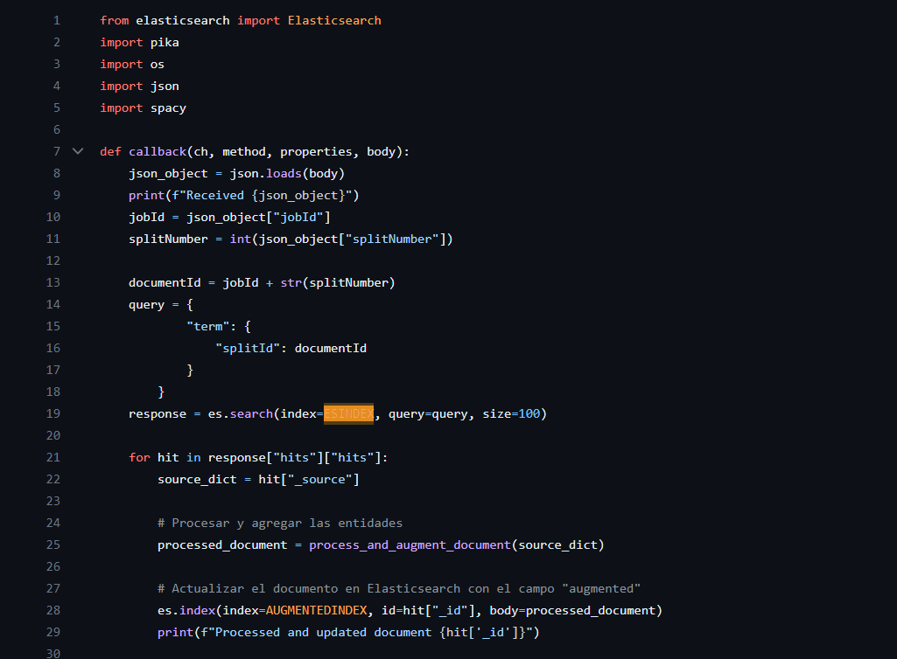

En la figura anterior se muestra el método callback, encargado de leer los mensajes publicados por el API Crawler en la cola de RabbitMQ. Este componente está recibiendo mensajes de la cola extraída de la variable de entorno SPACY_QUEUE.

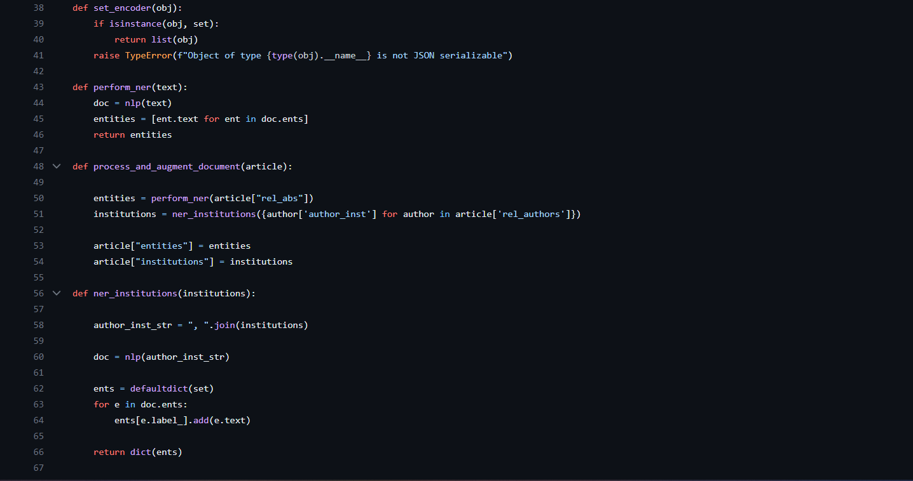

En esta sección se muestran los métodos encargados de parsear los json.

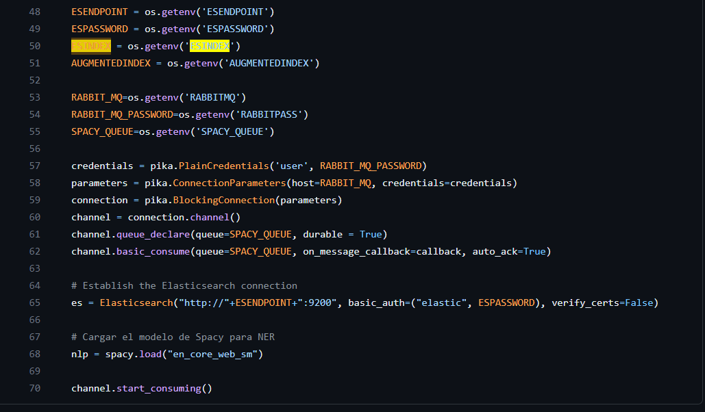

Finalmente, se define la configuración y variables de ambiente para la conexión a la cola de RabbitMQ y elasticsearch.

### Controller

Este componente cumple con la función de revisar continuamente el índice. En el momento que detecta este documento, hace un llamado al API de bioRxiv, capturando el valor llamado messages.total. Con esto el controller genera varios splits, los mismos son una porción de los articulos que se deben descargar. Y por cada split publica un mensaje en RabbitMQ a la cola dada por la variable de entorno CRAWLER_QUEUE.

#### Implementación Controller

 A continuación, se muestra la implementación del componente Controller.

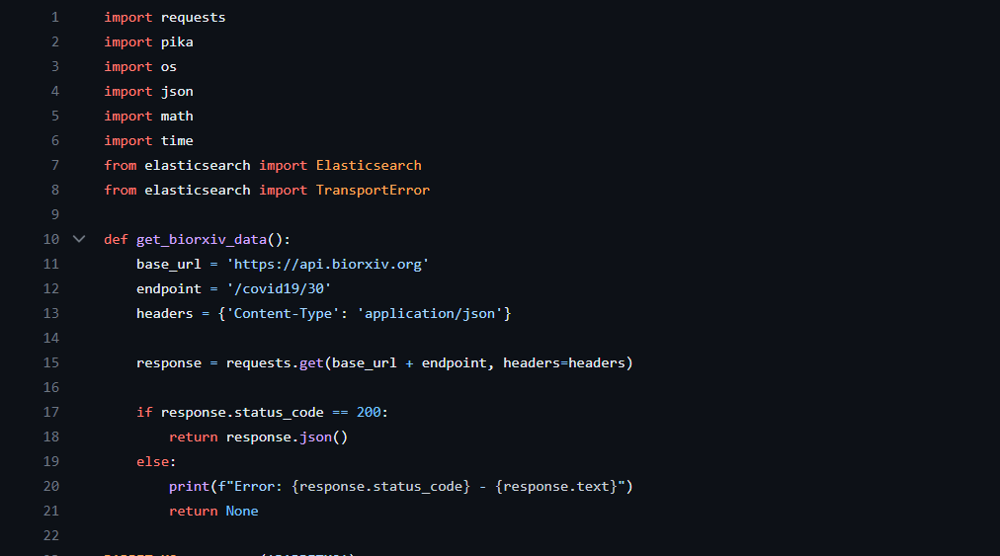

En la figura anterior se encuentra la implementación del método get_biorxiv_data. El cual se encarga de hacer un request al API de bioRxiv y retornando el response en caso de recibir un response status code igual 200. Este método usa la librería de [Requests](https://requests.readthedocs.io/en/latest/user/quickstart/). Está permite enviar solicitudes de HTTP a servicios, como el API.

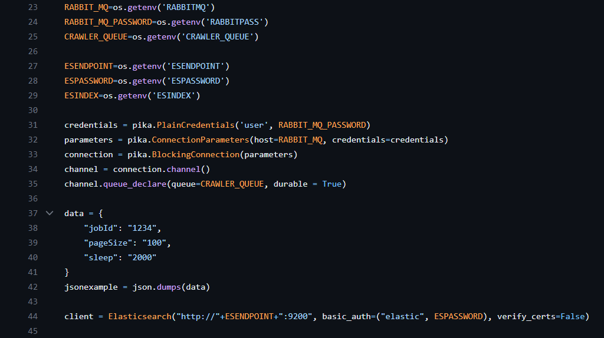

Posteriormente, se define las variables de entorno necesarias para establecer las conexiones tanto de elasticsearch como de RabbitMQ. Además, se inicializa la conexión al Elasticsearch.

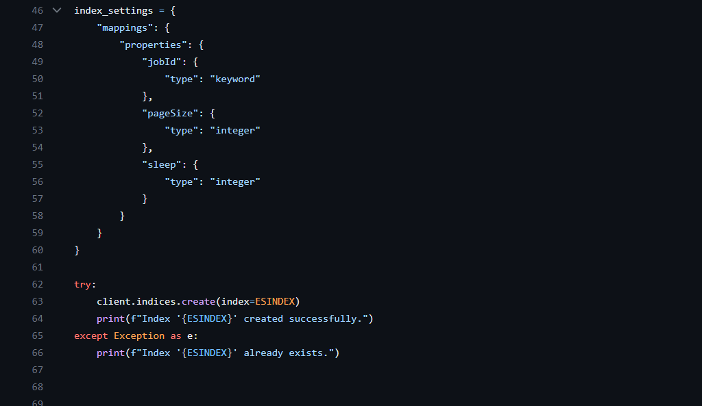

En esta sección se [crea el índice de jobs](https://kb.objectrocket.com/elasticsearch/how-to-create-and-delete-elasticsearch-indexes-using-the-python-client-library) para el cliente de elasticsearch, tal como se indica en el código.

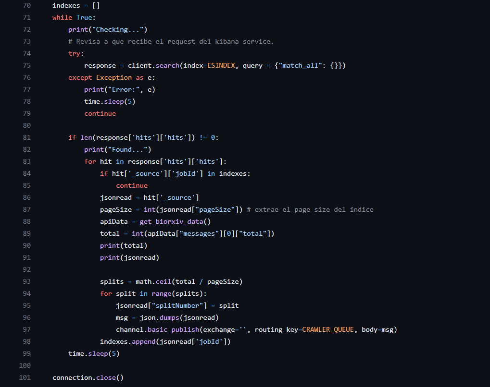

Finalmente, un ciclo donde se va a procesar el valor de messages.total y se generan los splits para publicarlos en la cola de RabbitMQ.

### API Crawler

El API Crawler es el componente encargado de leer los mensajes publicados en el RabbitMQ provenientes del Controller. Estos mensajes los lee de la cola llamada CRAWLER_QUEUE. Además, este se encarga de descargar los archivos de API bioRxiv y los almacena en un índice de ElasticSearch llamado raw. Y al finalizar publica un mensaje en una cola de RabbitMQ.

#### Implementación API Crawler

 A continuación, se muestra al implementación del componente API Crawler.

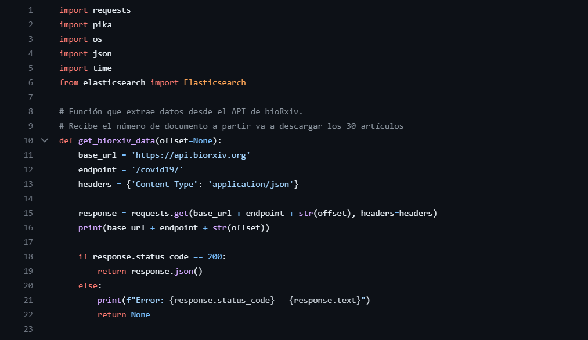

En la figura anterior se encuenta la implementación del metodo get_biorxiv_data. El cual se encarga de hacer un request al API de bioRxiv y retornando el response en caso de recibir un response status code igual a 200. Este utiliza la librería de [Requests](https://requests.readthedocs.io/en/latest/user/quickstart/).

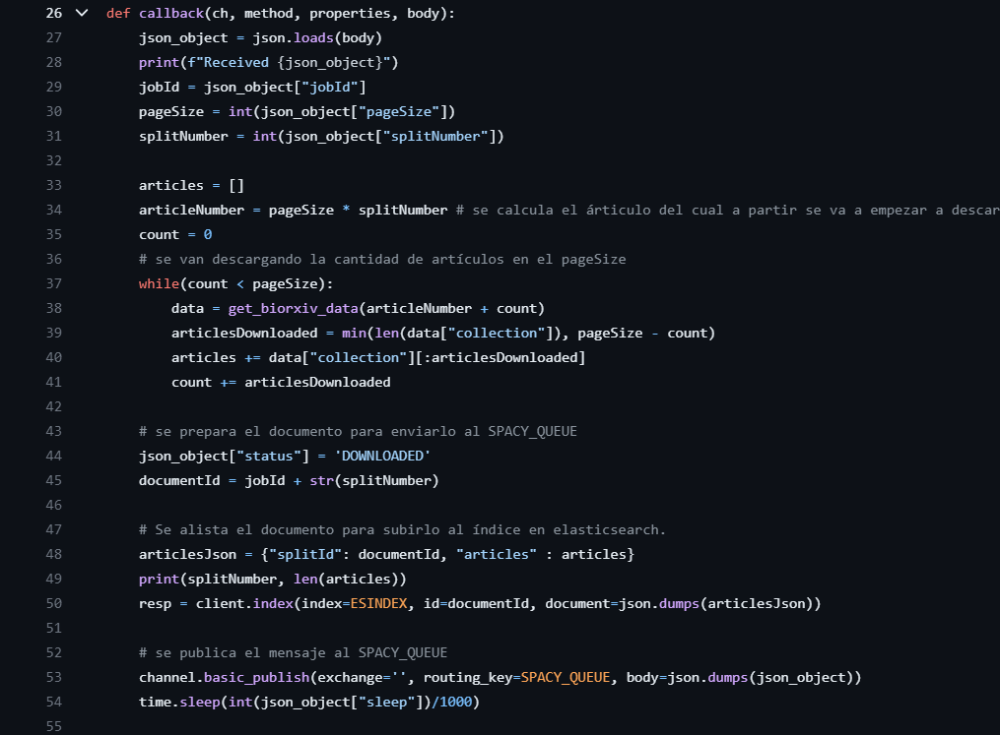

Posteriormente, en esta figura se muestra la implementación del método callback. El cual se encarga de leer los mensajes de RabbitMQ provenientes del Controller, hace un request al API de bioRxiv para obtener los artículos y los prepara para publicarlos en la cola SPACY_QUEUE.

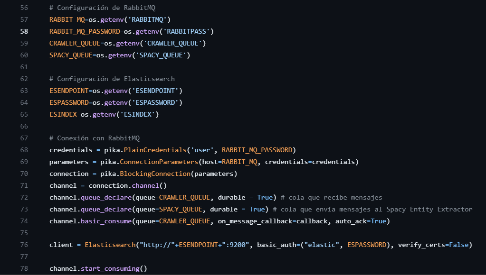

Finalmente se definen las variables de entorno para la configuración de la conexión con RabbitMQ y Elasticsearch.

### SparkSQL

SparkSQl es el componente encargado de leer el índice augmented que se ejecutara de forma manual y aplicará ciertas transformaciones a los datos. Una vez transformados, este lo publicará en un índice llamado documents.

#### Implementación SparkSQL

Spark será probado manualmente mediante la consola de Windows, el código de ejecución de este se encuentra [aquí](/bioRxiv%20Search/commands.scala). Estos comandos se encuentran debidamente documentados y de igual forma en la Ejecución y Pruebas Realizadas se mostrará el funcionamiento de cada uno ya que se deben de ejecutar manualmente.

## Ejecución y Pruebas Realizadas
Para iniciar con las pruebas debe de haber sido necesario realizar el proceso de pre-instalación e instalación para el cluster de Kubernetes. Una vez se tiene todo listo se puede iniciar.

El primer paso es acceder a Kibana mediante el NodePort: [Kibana](https://localhost:30091) e ingresar las credenciales, el usuario predeterminado es **elastic** y la contraseña se puede accesar por medio de Lens en el apartado de *Config* en el apartado de *Secrets* bajo el nombre de **ic4302-es-elastic-user**. Es importante recordar hacer click sobre el ojo para decodificar la contraseña. Ya decodificada se puede copiar y pegar en Kibana.

Una vez se ingresa a Kibana se abre el menú y se abre el apartado de *Management* bajo el nombre de *Dev Tools* para acceder a la consola de Kibana.

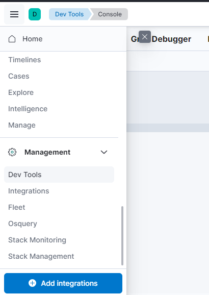

En la consola se ejecutará el siguiente comando el cual en el índice de jobs ingresa un nuevo job con el formato especificado:

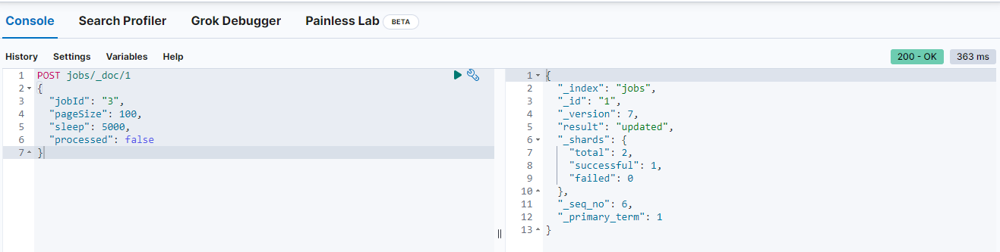

Una vez se ingrese el nuevo job, el controller verificará este indice de *jobs* y se dará cuenta que debe de enviar los splits con el mensaje a una cola de RabbitMQ. Cuando el Controller ya lo leyó, actualiza el documento y cambia el campo de "_processed_" a true. De esta manera, no va volver a leer los documentos ya procesados. El crawler entonces empieza a consumir estos mensajes y empieza a extrar la información cruda del BioRxiv API y la guarda en un índice llamado raw, esto se puede verificar con el siguiente comando:

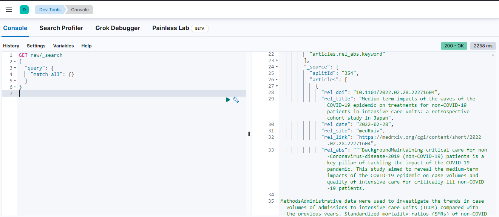

Una vez que se van extrayendo los datos, el crawler va publicando mensajes en otra cola llamada SPACY_QUEUE para que el Spacy los detecte y empiece con el Named Entity Recognition y guarde las nuevas entidades en un índice que se llama *augmented*, esto se puede verificar con el siguiente comando:

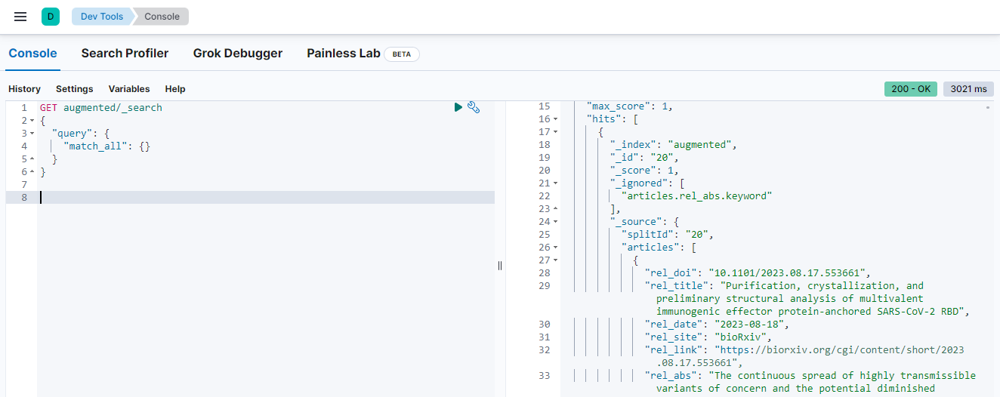

Finalmente como último proceso de verificación se ejecutará el código de SparkSQL con Scala. Como primer paso se debe abrir la consola de Windows y navegar hasta donde se guardó el archivo extraído de la pre-instalación. Una vez dentro de la carpeta, se ingresará a la carpeta de bin y se ejecutará el siguiente comando:
`spark-shell`
Una vez inicie Spark, se verá de esta forma:

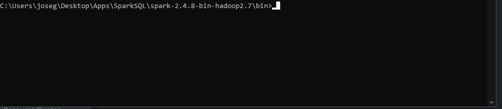

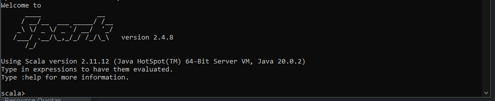

Dentro del shell se procederá a copiar el código en el archivo de [Scala](/bioRxiv%20Search/commands.scala).

### Código Kibana
```
POST jobs/_doc/1
{
  "jobId": "1",
  "pageSize": 100,
  "sleep": 5000,
  "processed": false
}

GET jobs/_search
{
  "query": {
    "match_all": {}
  }
}

GET raw/_search
{
  "query": {
    "match_all": {}
  }
}

GET raw/_search
{
    "query": {
        "term": {
            "splitId": "12"
        }
    }
}

GET /augmented/_search
{
  "query": {
    "match_all": {}
  }
}
GET /augmented/_mapping
GET /documents/_search
{
  "query": {
    "match_all": {}
  }
}

```

### Códigos Scala

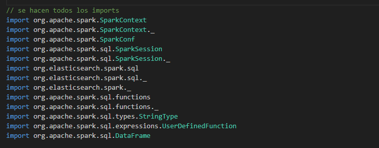
La imagen anterior muestra los imports necesarios para ejecutar las pruebas.

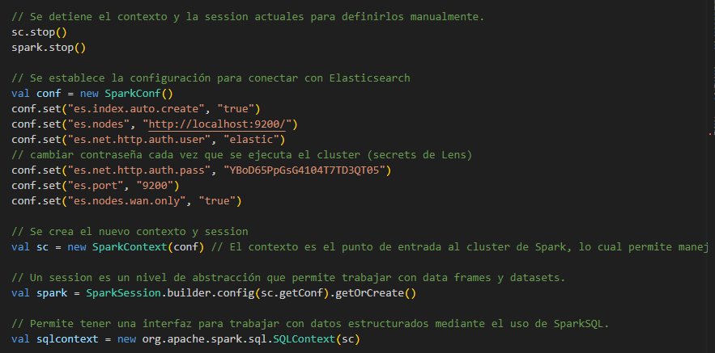
En esta imagen se detiene el contexto inicial y se crea uno propio, seguidamente se configura la conexión a elasticsearch con la credenciales correctas.

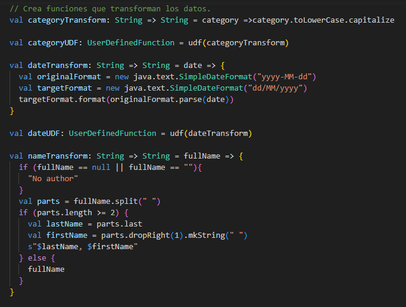
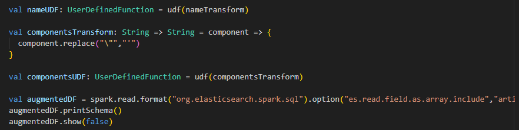
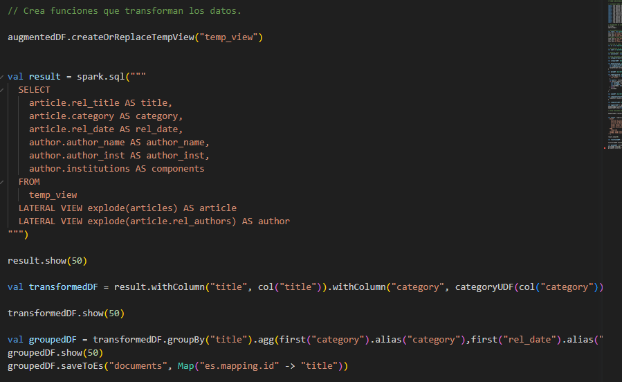
Finalmente, se crean la funciones transforman los datos, por ejemplo: 
- El author_name, deberá convertirse en formato Apellido, Nombre.
- El author_inst deberá separarse en sus componentes
- El category debe convertir cada primera letra de palabra en mayúscula y remover
espacios a los lados.
- El rel_date debe convertirse al formato dd/mm/yyyy. 
Y luego se suben a un nuevo índice en elasticseach con el nombre de documents.

### Ejecución

Cuando se ejecute se deberá ver algo similiar a las siguientes capturas:
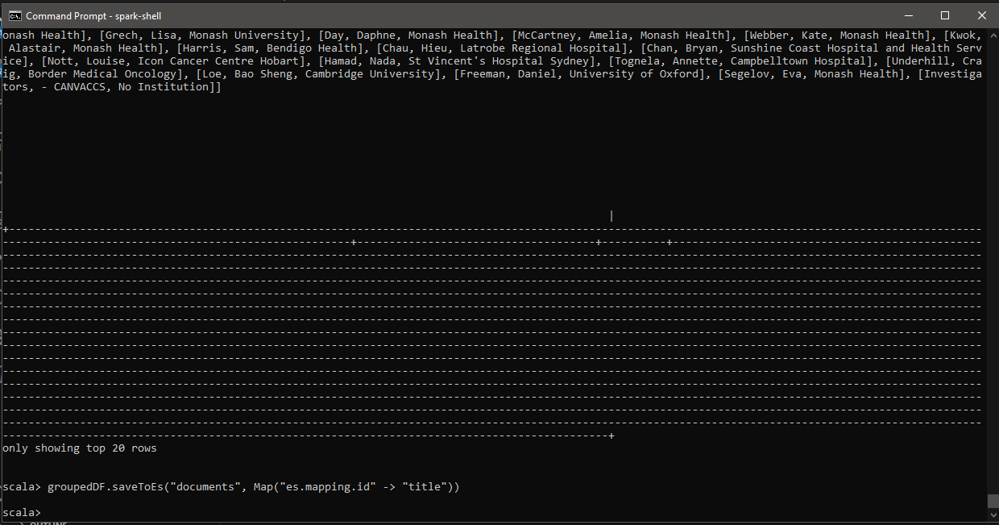

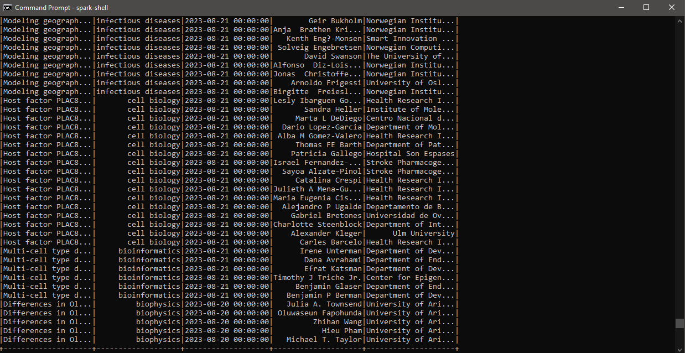

Una vez finalizada la ejecución se debe verificar que no haya ocurrido ningún error, seguidamente se puede verificar en kibana los datos actualizados en el índice de *documents*:

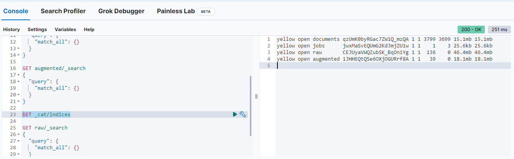

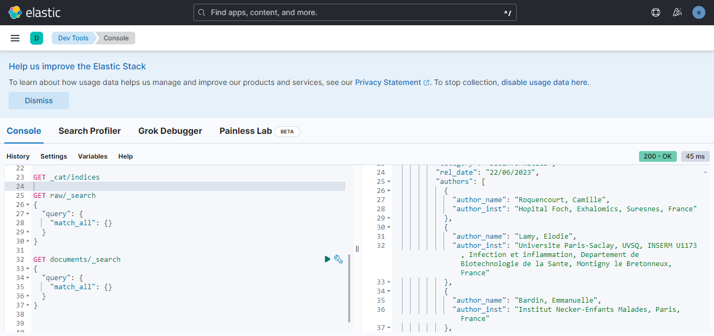

## Resultados Pruebas Unitarias

Respecto a las pruebas unitarias, debido al poco código generado durante el desarrollo del proyecto, únicamente se logran identificar 2 componentes a los cuales se les puede realizar un unit test, los cuales serán mencionados más adelante. Esto bajo la premisa de probar únicamente código generado para la implementación del "motor de búsqueda" de artículos científicos, omitiendo las funciones que generen conexiones con los distintos componentes del sistema, tales como RabbitMQ, Elasticsearch y Spacy.

### Controller

Referente al controller, este cuenta únicamente con un método, get_biorxiv_data, el cual se encarga de hacer un request al API de bioRxiv y retornar un response. El response retornado por get_biorxiv_data puede ser null o bien un json, esto depende del response status code proveneiente del API. Debido a que no podemos controlar el comportamiento del API de bioRxiv, no se puede generar casos de prueba sobre los posibles errores y se procede únicamente a validar el resultado proveniente del método anteriormente mencionado.

A continuación, se muestra el código del unit test generado para el método del controller.

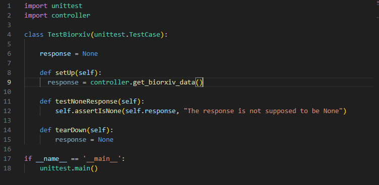

El resultado de esta prueba es positivo ya que funciona correctamente al ejecutar el sistema. En caso de recibir un status code diferente a 200 este indica el error.

### Crawler

Caso similar al controller, el crawler unicamente cuenta con 2 métodos, de los cuales solo el método get_biorxiv_data es sujeto para un unit test. Este se encarga de hacer un request al API de bioRxiv y recibir un response con los artículos científicos. El unit test para el mismo se presenta en la sigueinte figura.

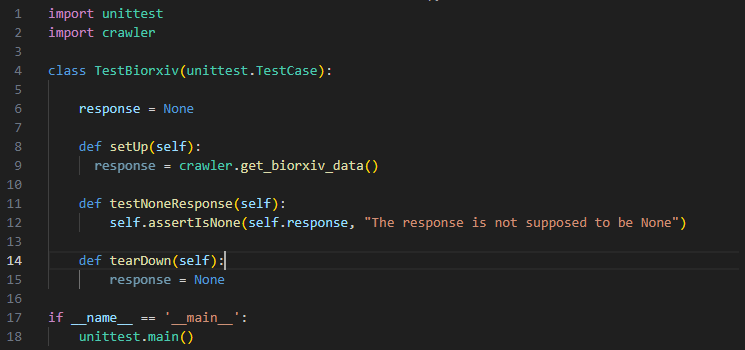

El resultado de esta prueba es positivo ya que funciona correctamente al ejecutar el sistema. En caso de recibir un status code diferente a 200 este indica el error.

## Recomendaciones y Conclusiones

A continuación, se presentan una serie de recomendaciones con el fin de un desarrollo más eficiente de los componentes que forman parte de este sistema. Adicionalmente, se muestran una serie de conclusiones al momento de finalizar el proyecto.

### Recomendaciones

1. Mejorar el trabajo en equipo.
2. Una buena distribución del trabajo.
3. Estudiar a profundidad cada una de las tecnologías a trabajar.
4. Invertir tiempo en aprender Kubernetes.
5. Establecer consultas periódicas y puntuales con el profesor a cargo.
6. Establecer entregas periódicas.
7. Buena comunicacion de equipo.
8. Adecuada organizacion del GIT(repositorio).
9. Mejorar las prácticas de programacion.
10. Realizar reuniones grupales periódicas donde todos los integrantes participen.
11. Incorporar estrategias de métodos ágiles como SCRUM.
12. Guardar las fuentes de donde se extrajo el código.
13. Escribir archivos de automatización por medio de archivos .sh o Makefile. Estos pueden ser usados para instalar helm charts automáticamente o para subir imágenes a Docker Hub.
14. Hacer imágenes de Docker para el desarrollo que utilicen un bind mount para no tener que recompilar la imágen.

### Conclusiones

1. Para el manejo de datos semi-estructurados no es posible utilizar una base de datos SQL de forma óptima.
2. ElasticSearch es muy eficiente con grandes volúmenes de datos.
3. La configuración establecida entre elasticsearch y python fue realizada con facilidad, por lo que las librerias utilizadas son intuitivas y fáciles de configurar.
4. Los mensajes de RabbitMQ funcionan de manera muy eficiente y rápida para el programa desarrollado. Resaltando algunas de las características competitivas del message broker.
5. Docker es realmente intuitivo una vez comprendida la teoría. Obteniendo así una eficaz herramienta para el desarrollo de software.
6. Kubernetes es una herramienta complicada de utilizar. Sin embargo, agrega gran beneficio en temas de automatización, escalado y administración de contenedores.
7. A nivel de cluster puede llegar a ser compleja la búsqueda y resolución de errores.
8. Se genera un aprendizaje básico en cuanto a la arquitectura de microservicios.
9. Es necesario leer la documentación de los helm charts para entender el funcionamiento y parámetros requeridos para el correcto funcionamiento de los mismos.
10. Se comprende de forma básica los servicios de extracción de entidades.

## Referencias

1. UnitTest — Unit Testing framework. (s. f.). Python documentation. https://docs.python.org/3/library/unittest.html
2. UnitTest — Unit Testing framework. (s. f.). Python documentation. https://docs.python.org/3/library/unittest.html#unittest.TestCase.assertEqual

